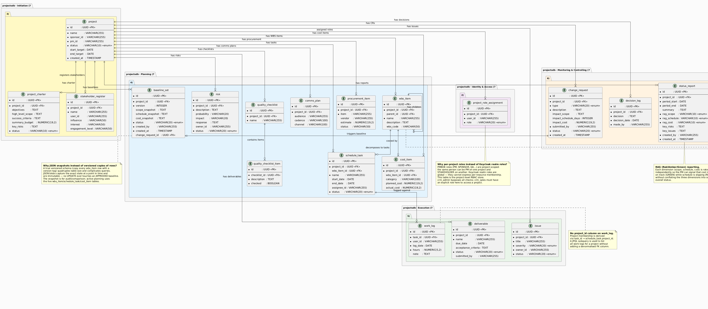

# Architecture

## Diagrams

| Diagram | File | Description |
|---------|------|-------------|
| Service topology | [architecture.puml](architecture.puml) | All services, routing, databases, messaging |
| Authenticated request flow | [flow.puml](flow.puml) | Sequence diagram: browser → gateway → service → DB |
| Stage & lifecycle states | [stages.puml](stages.puml) | Opportunity workflow + PMBOK project lifecycle |
| Database schema | [database.puml](database.puml) | All tables across all services |

Render with PlantUML (Docker):
```powershell
docker run --rm -v "${PWD}/docs:/data" plantuml/plantuml /data/architecture.puml
docker run --rm -v "${PWD}/docs:/data" plantuml/plantuml /data/flow.puml
docker run --rm -v "${PWD}/docs:/data" plantuml/plantuml /data/stages.puml
```

VS Code: install [PlantUML extension](https://marketplace.visualstudio.com/items?itemName=jebbs.plantuml), open `.puml` file, press `Alt+D`.




---

## Services

| Service | Port | Role |
|---------|------|------|
| **Gateway** | 8080 (host) | Single public entry point. Routes all traffic, enforces per-user rate limiting (20 req/s via Bucket4j, keyed by JWT `preferred_username`), publishes every `/api/*` request to RabbitMQ. |
| **Accounts** | 8081 | CRM accounts. |
| **Contacts** | 8082 | Contacts linked to accounts. |
| **Opportunities** | 8083 | Opportunities with stage-transition workflow. |
| **Activities** | 8084 | Activities linked to opportunities. |
| **Projects** | 8085 | PMBOK project management — charter, WBS, tasks, baselines, deliverables, change requests, status reports, closing. |
| **Diagrams** | 8086 | Interactive canvas diagrams — nodes referencing live CRM/Projects entities, edges, sticky notes. Stored per user in `diagramsdb`. |
| **Config Server** | 8888 | Spring Cloud Config Server. Serves centralised properties to all services at startup (classpath/native backend). |
| **Customer** | 8080 (internal) | Legacy customer records service. |
| **Log Consumer** | — | Consumes `request-logs` queue, writes each request to `logsdb`. |
| **Keycloak** | 8080 (internal) | Identity provider. Issues JWTs, manages the `crm` realm, roles `crm_admin` / `crm_sales`. |
| **RabbitMQ** | 5672 / 15672 | Message broker. Decouples gateway from log writing; carries stage-change events. |
| **PostgreSQL (main)** | 5432 | Shared DB for CRM services (`accountsdb`, `contactsdb`, `opportunitiesdb`, `activitiesdb`, `projectsdb`, `maindb`). |
| **PostgreSQL (keycloak)** | 5432 | Dedicated DB for Keycloak's internal state. |
| **PostgreSQL (logsdb)** | 5432 | Dedicated DB for the request audit log. |

## Traffic flow

```
Browser / curl
      │
      ▼
localhost:8080  (Gateway — single public entry point)
      │
      ├── /auth/**                            ──►  Keycloak :8080
      ├── /api/accounts/*/contacts/**         ──►  Contacts :8082
      ├── /api/accounts/**                    ──►  Accounts :8081
      ├── /api/opportunities/*/activities/**  ──►  Activities :8084
      ├── /api/opportunities/**               ──►  Opportunities :8083
      ├── /api/projects/**                    ──►  Projects :8085
      ├── /api/diagrams/**                    ──►  Diagrams :8086
      └── /api/customers/**                   ──►  Customer :8080 (internal)
                             │
                        GlobalFilter (all /api/* requests)
                        rate-limit 20 req/s per user · publish to RabbitMQ
                             │
                        Log Consumer ──► logsdb
```

Nested routes (e.g. `/api/accounts/*/contacts`) are declared **before** their parent catch-all
routes in `GatewayRoutingConfig` — required because Spring Cloud Gateway matches in declaration
order.

---

## Authentication

### How it works

Every endpoint (except `/auth/**` and `/actuator/health/**`) requires a Keycloak JWT in the
`Authorization: Bearer <token>` header. The **Gateway does not validate tokens** — each downstream
service independently validates the JWT as an OAuth2 Resource Server. This provides defence in
depth: a bypassed or misconfigured gateway cannot grant access to downstream services.

### JWT validation

Services use `jwk-set-uri` (not `issuer-uri`) to validate tokens:

```properties
spring.security.oauth2.resourceserver.jwt.jwk-set-uri=
  http://keycloak:8080/auth/realms/crm/protocol/openid-connect/certs
```

`jwk-set-uri` validates only the cryptographic signature and skips issuer verification. This is
necessary because Keycloak's tokens carry `iss: http://localhost:8080/auth/realms/crm` (external
URL) while services resolve Keycloak internally as `http://keycloak:8080`. See
[decisions.md](decisions.md) for the full explanation.

### Role extraction

Each service's `SecurityConfig` maps Keycloak's `realm_access.roles` claim to Spring Security
`GrantedAuthority` objects:

```
JWT claim: { "realm_access": { "roles": ["crm_admin", "crm_sales"] } }
  → ROLE_crm_admin
  → ROLE_crm_sales
```

### Resource-based access control (CRM)

| Role | Access |
|------|--------|
| `crm_admin` | Full access to all resources |
| `crm_sales` | Only resources where `ownerId == token.sub` |

`ownerId` is always set server-side from `jwt.getSubject()` at creation time — clients cannot
supply or override it.

Enforced via the `@perm` Spring bean (`PermissionService`):

```java
@GetMapping("/{id}")
@PreAuthorize("@perm.canAccess(#id, authentication)")
public ResponseEntity<Account> get(@PathVariable UUID id) { ... }
```

Non-owners receive `HTTP 403`. Non-existent resources also return `403` (not `404`) to avoid
leaking the existence of records to unauthorised callers.

### Per-project role access (Projects)

PMBOK roles (`PM`, `SPONSOR`, `TEAM_MEMBER`, `QA`, `STAKEHOLDER`, `FINANCE`, `PROCUREMENT`) are
**per-project** and stored in `project_role_assignment(project_id, user_id, role)`. Checked by
`ProjectPermissionService` (`@projectPerm` bean):

```java
@PreAuthorize("@projectPerm.hasRole(#projectId, 'PM', authentication)")
```

---

## Business Rules

### Opportunity stage workflow

Transitions are **forward-only**; skipping stages is not allowed. Any stage can go directly to
`LOST`. `WON` and `LOST` are terminal.

```
PROSPECT → QUALIFY → PROPOSE → NEGOTIATE → WON
    ↓          ↓         ↓          ↓
   LOST      LOST      LOST       LOST
```

Invalid transition → `HTTP 400`.

### WON gate

Before transitioning to `WON`, both `amount` and `closeDate` must be set on the opportunity.
Returns `HTTP 400` if either is missing.

### Stage change audit trail

Every successful stage transition automatically creates an `Activity` of type `NOTE`:

```
Stage changed QUALIFY -> PROPOSE by johndoe
```

The call to Activities is best-effort — failure never blocks the stage transition.

### Stage changed event (RabbitMQ)

`StageAuditService` also publishes a `StageChangedEvent` to the `opportunity-events` queue on
every stage transition:

```json
{
  "opportunityId": "...",
  "fromStage": "QUALIFY",
  "toStage": "PROPOSE",
  "changedBy": "johndoe",
  "timestamp": "2025-06-01T10:30:00Z"
}
```

No consumer is implemented yet — the event is available for future integrations.

---

## PMBOK Rules

### Baseline snapshots

When a baseline is created, the service serialises the current WBS items, schedule tasks, and cost
items into three JSON columns (`scope_snapshot`, `schedule_snapshot`, `cost_snapshot`). Once
`APPROVED`, the row is never updated — permanently immutable and auditable.

### Change request → baseline link

When a `SCOPE`, `SCHEDULE`, or `COST` change request is approved, a new `DRAFT` baseline is
automatically created and linked via `baseline_set.change_request_id`. The PM must submit and
approve that baseline before the CR can be marked `IMPLEMENTED`. Every scope/schedule/cost change
is traced to a corresponding approved revised plan.

### Polymorphic approval record

All approval workflows (charter, baseline, change request, deliverable, closure) write into a
single `approval` table with `resource_type` (CHARTER / BASELINE / CHANGE_REQUEST / DELIVERABLE /
CLOSURE) and `resource_id` columns. Five separate tables with identical columns would be pure
duplication.

### Project close gate

`POST /api/projects/{id}/close` requires:
1. Closure report status = `APPROVED`
2. All deliverables = `ACCEPTED` (or waivers noted in `closure_report.acceptance_summary`)

---

## Messaging (RabbitMQ)

| Queue | Producer | Consumer | Purpose |
|-------|----------|----------|---------|
| `request-logs` | Gateway (all `/api/*` requests) | Log Consumer | Request audit log → `logsdb` |
| `opportunity-events` | Opportunities (stage transitions) | *(none yet)* | Stage change events for future consumers |

Both queues are durable. All publishes are best-effort — failures are logged and swallowed, never
blocking the main operation.
