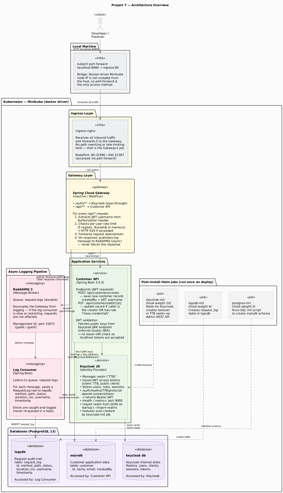

# Project Y — CRM MVP

## Architecture Diagram

The full architecture diagram is in [docs/architecture.puml](docs/architecture.puml).

| Tool | How |
|------|-----|
| Docker | `docker run --rm -v "$(pwd)/docs:/data" plantuml/plantuml /data/architecture.puml` (Bash) |
| Docker (PowerShell) | `docker run --rm -v "${PWD}/docs:/data" plantuml/plantuml /data/architecture.puml` |
| VS Code | Install [PlantUML extension](https://marketplace.visualstudio.com/items?itemName=jebbs.plantuml), open the file, press `Alt+D` |
| Online | Paste into [plantuml.com/plantuml](https://www.plantuml.com/plantuml/uml/) |



---

## Services

| Service | Role |
|---------|------|
| **Gateway** | Single public entry point on `:8080`. Routes all traffic, enforces per-user rate limiting (5 req/sec via Bucket4j), publishes every `/api/*` request to RabbitMQ. |
| **Customer** | REST API for customer records. Requires a valid JWT. |
| **Accounts** | REST API for CRM accounts. |
| **Contacts** | REST API for contacts linked to accounts. |
| **Opportunities** | REST API for opportunities with stage-transition workflow. |
| **Activities** | REST API for activities linked to opportunities. |
| **Keycloak** | Identity provider. Issues JWTs, manages the `crm` realm, roles (`crm_admin`, `crm_sales`). |
| **RabbitMQ** | Message broker. Decouples gateway from log writing via the `request-logs` queue. |
| **Log Consumer** | Listens to `request-logs` and writes each request (method, path, status, duration, username) to the logs DB. |
| **PostgreSQL (main)** | Shared DB for Customer, Accounts, Contacts, Opportunities, Activities (`maindb`, `accountsdb`, …). |
| **PostgreSQL (keycloak)** | Dedicated DB for Keycloak's internal state. |
| **PostgreSQL (logsdb)** | Dedicated DB for the request audit log. |

### Traffic flow

```
Browser / Postman / curl
        │
        ▼
  localhost:8080  (Gateway)
        │
        ├── /auth/**  ──►  Keycloak :8080
        └── /api/**   ──►  upstream services
                               │
                          GlobalFilter
                          publishes to RabbitMQ "request-logs"
                               │
                          Log Consumer ──► logsdb
```

### Test users (both environments)

| Username | Password | Role |
|----------|----------|------|
| `testuser` | `testpassword` | `crm_sales` |
| `testuser2` | `testpassword2` | `crm_sales` |

Get a JWT:
```
POST http://localhost:8080/auth/realms/crm/protocol/openid-connect/token
Content-Type: application/x-www-form-urlencoded

grant_type=password&client_id=crm-api&username=testuser&password=testpassword
```

---

## Environment Setup

<details>
<summary><strong>Docker Compose (fast local dev)</strong></summary>

### How it works

All services run as Docker containers on a single bridge network. The Gateway listens on host port `8080`. No Kubernetes or ingress-nginx involved — Gateway IS the entry point.

```
localhost:8080 (Gateway container, port published directly)
      │
      ├── /auth/**  ──►  keycloak:8080  (container-internal)
      └── /api/**   ──►  upstream service containers
```

RabbitMQ management UI is also published: `http://localhost:15672` (guest / guest).

### Prerequisites

- Docker Desktop (running)
- Java 17 JDK on `PATH` (for Gradle builds)

### Scripts

| Script | Purpose |
|--------|---------|
| `.\scripts\docker\compose-up.ps1` | Build JARs + images, start all containers |
| `.\scripts\docker\compose-up.ps1 -Detach` | Same but detached (background) |
| `.\scripts\docker\compose-up.ps1 -SkipBuild` | Skip Gradle, rebuild images only |
| `.\scripts\docker\compose-down.ps1` | Stop and remove all containers |
| `.\scripts\docker\compose-down.ps1 -Volumes` | Also wipe all data volumes (full reset) |
| `.\scripts\docker\system-test.ps1` | End-to-end smoke tests (22 checks) |

### Quick start

```powershell
# Build everything and start (takes ~3-5 min on first run)
.\scripts\docker\compose-up.ps1 -Detach

# Watch logs
docker compose logs -f

# Run smoke tests (wait for all services to be healthy first)
.\scripts\docker\system-test.ps1
```

### Service health

```powershell
# Check all containers
docker compose ps

# Follow logs for a specific service
docker compose logs -f gateway
docker compose logs -f log-consumer

# Inspect the request audit log
docker compose exec postgres-logs psql -U loguser -d logsdb -c "SELECT * FROM request_log ORDER BY id DESC LIMIT 10;"
```

### Full reset

```powershell
# Stop everything and wipe all data volumes
.\scripts\docker\compose-down.ps1 -Volumes
```

### Keycloak admin

```
http://localhost:8080/auth/admin
Username: keycloak  |  Password: keycloak
Realm: crm
```

Users (`testuser`, `testuser2`) are created automatically by the `keycloak-init` container on first startup.

</details>

---

<details>
<summary><strong>Kubernetes / Minikube (staging-like)</strong></summary>

### How it works

All services run as Kubernetes Deployments managed by a Helm chart. `ingress-nginx` routes traffic to the Gateway, which then routes internally. Port-forward is used to expose the ingress controller to the host because the Minikube Docker driver does not expose the node IP.

```
localhost:8080 (kubectl port-forward → ingress-nginx)
      │
      ▼
ingress-nginx
      │
      └── /*  ──►  Gateway :8080  ──►  upstream services
```

### Prerequisites

- [Minikube](https://minikube.sigs.k8s.io/) with Docker driver
- [kubectl](https://kubernetes.io/docs/tasks/tools/)
- [Helm 3](https://helm.sh/)
- Docker Desktop
- Java 17 JDK on `PATH`

### Scripts

| Script | Purpose |
|--------|---------|
| `.\scripts\kubernetes\env-up.ps1` | Start Minikube, build all images, deploy Helm chart, start port-forward |
| `.\scripts\kubernetes\reinstall.ps1` | Rebuild all images + `helm upgrade` |
| `.\scripts\kubernetes\reinstall.ps1 -SkipBuild` | `helm upgrade` only (skip image rebuild) |
| `.\scripts\kubernetes\reinstall.ps1 -HardReset` | `helm uninstall` + `helm install` (clears PVCs) |
| `.\scripts\kubernetes\env-down.ps1` | Stop port-forward + `helm uninstall` |
| `.\scripts\kubernetes\env-down.ps1 -StopMinikube` | Also stop the Minikube VM |
| `.\scripts\kubernetes\port-forward.ps1 start/stop/status` | Manage background port-forward |
| `.\scripts\kubernetes\system-test.ps1` | End-to-end smoke tests |

### Quick start

```powershell
# First-time setup (takes ~10-15 min)
.\scripts\kubernetes\env-up.ps1

# After code changes: rebuild images + redeploy
.\scripts\kubernetes\reinstall.ps1

# After Helm/values changes only (no code change):
.\scripts\kubernetes\reinstall.ps1 -SkipBuild

# Run smoke tests
.\scripts\kubernetes\system-test.ps1
```

### Manual build (when needed)

```powershell
# Point Docker CLI at Minikube's daemon (required before every build session)
& minikube -p minikube docker-env --shell powershell | Where-Object { $_ -match '^\$Env:' } | Invoke-Expression

# Build a single service
Push-Location Gateway; .\gradlew.bat clean build -x test; docker build -t gateway:latest .; Pop-Location
```

### Watch pod status

```powershell
kubectl get pods -w
```

Expected steady state:

| Pod | Status |
|-----|--------|
| gateway | 1/1 Running |
| keycloak | 1/1 Running |
| customer | 1/1 Running |
| accounts, contacts, opportunities, activities | 1/1 Running |
| rabbitmq | 1/1 Running |
| log-consumer | 1/1 Running |
| postgres, postgres-keycloak, postgres-logs | 1/1 Running |
| postgres-init (Job) | Completed |
| keycloak-init (Job) | Completed |
| logsdb-init (Job) | Completed |

### Helm commands

```powershell
# List releases
helm list

# Show current effective values
helm get values project-y

# Render templates locally without applying
helm template project-y ./deployment -f ./deployment/values-dev.yaml --debug

# Rollback
helm rollback project-y
```

### Debug commands

```powershell
# Logs (follow)
kubectl logs -l app=gateway -f
kubectl logs -l app=log-consumer -f
kubectl logs -l app=keycloak -f

# Describe a failing pod
kubectl describe pod <pod-name>

# Check ingress routing
kubectl describe ingress api-ingress

# Inspect the request audit log
kubectl exec deployment/postgres-logs -- psql -U loguser -d logsdb -c "SELECT * FROM request_log ORDER BY id DESC LIMIT 10;"

# RabbitMQ management UI (temporary port-forward)
kubectl port-forward svc/rabbitmq 15672:15672
# then open http://localhost:15672  (guest / guest)
```

### Keycloak admin

```
http://localhost:8080/auth/admin
Username: admin  |  Password: admin
Realm: crm
```

</details>

---

## API Reference

All endpoints require `Authorization: Bearer <JWT>` (except `/auth/**`).

### Accounts
| Method | Path | Description |
|--------|------|-------------|
| `POST` | `/api/accounts` | Create account (`ownerId` = caller's `sub`) |
| `GET` | `/api/accounts?search=&page=` | List accounts |
| `GET` | `/api/accounts/{id}` | Get account |

### Contacts
| Method | Path | Description |
|--------|------|-------------|
| `POST` | `/api/accounts/{id}/contacts` | Create contact |
| `GET` | `/api/accounts/{id}/contacts` | List contacts |

### Opportunities
| Method | Path | Description |
|--------|------|-------------|
| `POST` | `/api/accounts/{id}/opportunities` | Create opportunity |
| `GET` | `/api/opportunities?mine=true&stage=&closingBefore=` | List opportunities |
| `GET` | `/api/opportunities/{id}` | Get opportunity |
| `PATCH` | `/api/opportunities/{id}` | Update fields |
| `POST` | `/api/opportunities/{id}/stage` | Advance stage |

Stage transitions: `PROSPECT → QUALIFY → PROPOSE → NEGOTIATE → WON / LOST`
`WON` requires `amount` and `closeDate` to be set.

### Activities
| Method | Path | Description |
|--------|------|-------------|
| `POST` | `/api/opportunities/{id}/activities` | Create activity |
| `GET` | `/api/opportunities/{id}/activities` | List activities |

### Customers (legacy)
| Method | Path | Description |
|--------|------|-------------|
| `POST` | `/api/customers/create` | Create customer record |
| `PUT` | `/api/customers/edit/{id}` | Update customer (owner or `boss-credential` only) |
